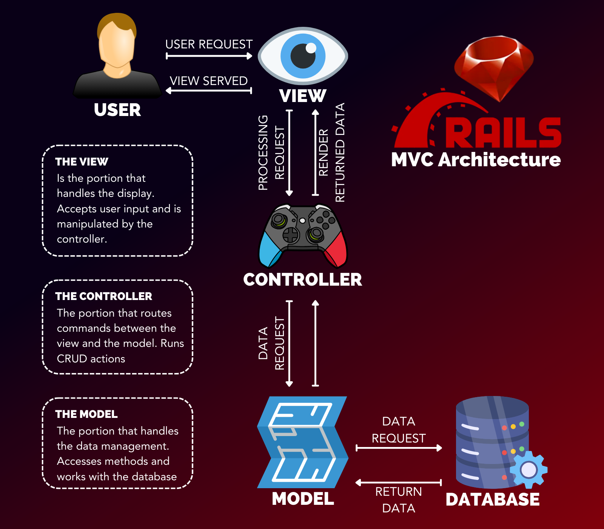

# Intro to Ruby on Rails

## Resources

1. Official Ruby on Rails Documentation [Ruby on Rails](rubyonrails.org)
2. Ruby on Rails Packages [Ruby Gems](rubygems.org)

## Getting Started

1. Create a new rails application
   `rails new application_name`
2. Run Rails server
   `rails s`
3. Default root route

- localhost:3000

## MVC Overview

### Model

### View

### Controller

## Rails App Structure

### App Directory

#### assets _stores static assets_

- config
  - .keep
- images
- stylesheets _stores css/scss stylesheets_
  - application.css _manifest file that is available to all application views_

#### channels _makes realtime communication available to the application_

- channel.rb
- connection.rb

#### controllers _where all additional controllers will be stored_

- concerns
  - .keep
- application_controller.rb _default functionality_

#### helpers _helper methods used in views templates_

- application_helper.rb

#### javascript _makes JavaScript available to the application_

- controllers
  - application.js
  - index.js
- application.js

#### jobs

- application_jobs.rb

#### mailers

- application_mailers.rb

#### models _where models are stored_

- concerns
  - .keep
- application_record.rb

#### views

- layouts _all views are served from this directory_
  - application.html.erb

### Bin Directory

## Generate a Model

## Generate a Controller

## Declaring Routes
